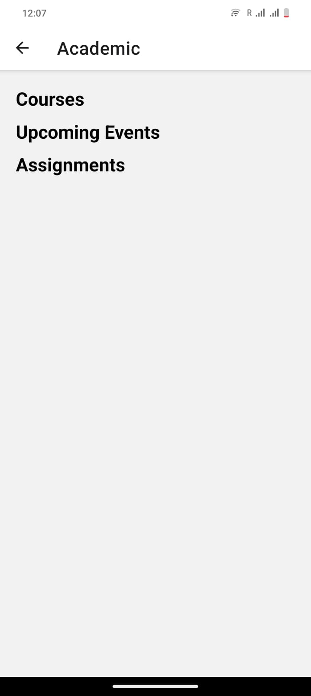

# Tech For Mobile Application Course
Final Project _ Let Us Connect

Koppula Rohith (M15890042)
Naga Chetan Pidugu (M15805944)

**Group_22**

## Description :

## About The Application:
- We designed this application for the students, especially for the freshmen who join the college. They can get to
know about the college or university and to help all students with their queries and connect one with
another.in the following sections we will give a detailed description about the application.

## Basic Idea/Problem: 
- It can be difficult for college students to manage their social and academic life, and
personal responsibilities. During their initial stages at college, they might need someone to guide them
properly and advise. Some might feel problematic with in person encounters with other people. The main
issue is the absence of a single plaDorm for managing every aspect of college life, such as social networking,
academic scheduling, campus resource navigation, and an online store for essentials, maps for directions and
advice for queries and many more. Current solutions lack in coordination. 

## Project Objective: 
- Let Us Connect aims to provide college students with comprehensive, easy-to-use
software that functions as a one-stop shop. It seeks to assist students in effectively managing their timetables,
establishing social and intellectual connections with classmates, navigating campus resources with ease, and
having access to a marketplace designed with college needs in mind. Simplifying college life will make it easier
to handle and more enjoyable.
Primary Users: Students in college looking for new connections and well-organized ways to balance their social
and academic life.

## Expected Results and Impact:
- Students can focus on their studies and manage time properly.
- With the help of chats and one-to-one interaction they can increase their social network and boost
their confidence to talk with people.
- They can easily access the online library; they can easily find the required resources and use them, and
they can get to know about all the required information about the campus.
- This application can build a network that promotes intellectual and personal development.

- Login Page

- Register Page

- Home Page

- Profile Page

- Acedemics

- Calender

- Chat

- Maps

- Market Management

- Resources

- To Do List

